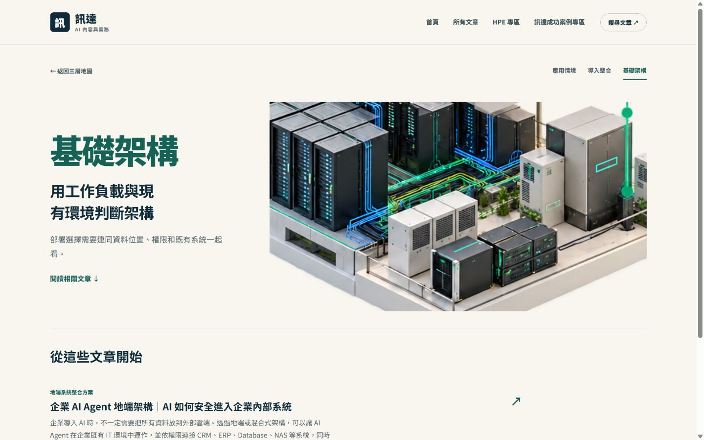
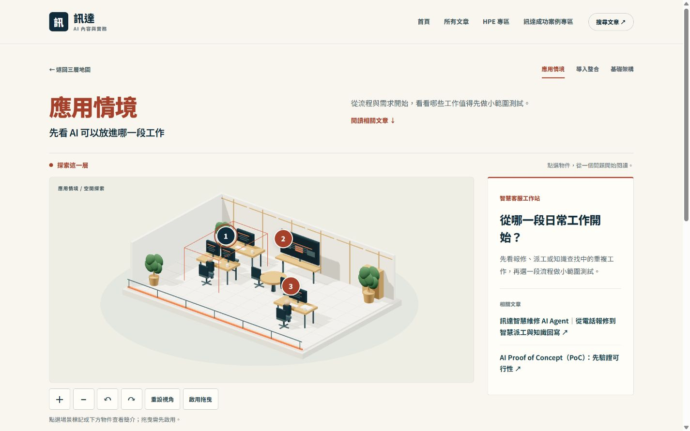
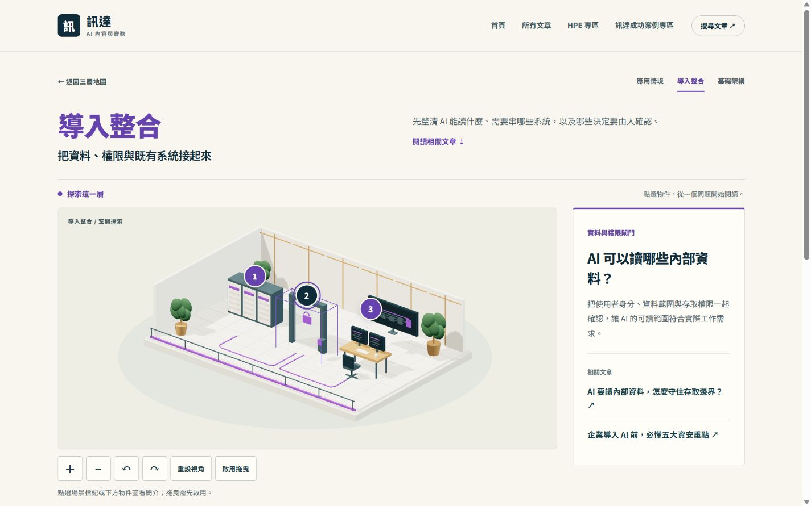
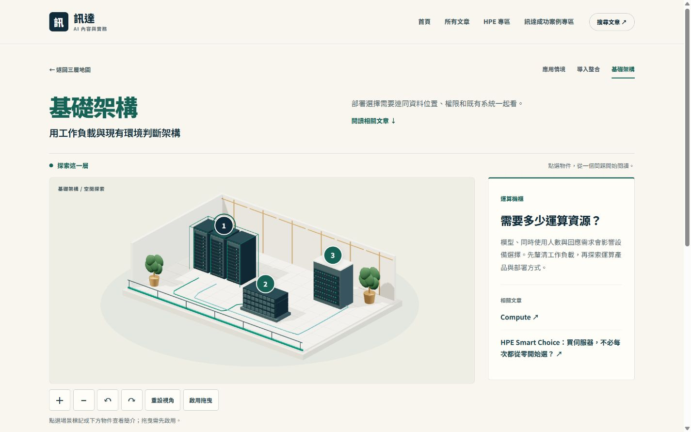

# 三層 3D 原型

三層概念場景使用 Three.js，可在既有網站的樓層入口探索物件與相關文章。這是簡化示意模型的功能原型；程式修改依 repository 的 PR 審核流程交付。

## 操作

1. 從首頁選擇應用情境、導入整合或基礎架構，也可直接開啟既有 `#layer-application`、`#layer-integration`、`#layer-infrastructure`。
2. 點場景標記、實體物件，或使用下方物件按鈕，開啟簡介與相關文章。
3. 使用 ＋／−、左右旋轉、重設視角。拖曳預設停用，以保留手機網頁滑動；啟用後可拖曳與雙指縮放。
4. 文章沿用 `?article=...`，增加 `from=scene-樓層` 供返回；只接受合法樓層及該文章確實存在的物件配對。原有文章與分類 URL 繼續使用。
5. 選取物件會在同一分頁的 sessionStorage 保存；只存樓層與物件 ID。重新進入樓層或返回文章時恢復選取；停用儲存時仍可操作。
6. 3D 失敗時保留圖片、物件按鈕與可展開的文字／文章清單，並提供重新載入按鈕。

## 檔案與素材

- `scene-explorer.js`：九個物件的簡介、已核准文章配對、HTML 文字備援、選取與懶載入。更換文章 ID 前需核對內容相關性與核准狀態。
- `scene-model.mjs`：Three.js 幾何建立三個獨立場景；沒有從 PNG 還原未見的實體模型。材質、燈光與模型是此次的簡化示意美術。
- `scene-renderer.mjs`：一個共用 WebGL renderer，當前樓層的 controls、raycast、鏡頭與標記。切換時釋放上一層的幾何、材質、陰影、observer 與事件；靜止時沒有持續動畫迴圈。同一畫面的繪製請求集中到一個 animation frame，靜態陰影只在建立新樓層時更新；初始化避免重複繪製。
- `scene-explorer.css`：樓層標題、場景、控制列、簡介與手機排版。原有品牌配色與字體沿用。
- `vendor/three/`：官方 Three.js `0.186.1` 的兩個 ES module、OrbitControls 與 MIT LICENSE，未改寫原始檔。npm lock 固定來源與版本，供打包與來源檢查使用。
- `assets/scene-runtime.mjs`：以 esbuild 打包與壓縮的瀏覽器模組，約 590 kB 未壓縮傳輸大小。合併場景、模型與必要的 Three.js 程式，避免多個大型模組循序載入；依使用者意圖預載，不在文章閱讀頁主動建立 3D。原始碼修改後執行 `npm run build:scene`，並提交生成檔。實際網路成本依主機壓縮與快取而異。
- `scripts/preview.cjs`：只在本機啟動的靜態預覽伺服器。`scripts/vendor-three.cjs`：從已安裝的固定套件複製所需檔案。
- `scripts/build-scene.cjs`：固定的打包設定。esbuild 是開發依賴，發布時直接使用已提交的生成檔；測試核對生成檔未過期。

模型皆為概念示意，不宣稱是客戶現場、特定 HPE 型號或中小企業必備規模。HPE 連結及文章正文未變更；先閱讀問題相關的內容，再探索既有產品介紹。

## 驗證與限制

使用 Node.js `22.23.1`、Codex 內建瀏覽器、本機預覽。自動測試 `npm test` 涵蓋原有閱讀／搜尋／路由、核准內容與轉義、場景文章返回、選取恢復、實體幾何／raycast／dispose，以及載入途中離開、切換樓層、WebGL 失敗與重試。

桌機 1440 × 900、手機模擬 390 × 844 與 320 × 844，已走訪三層、九個物件、控制按鈕、文章返回、Enter 選取及文字清單。觀察到模型縮放與旋轉，重設後標記投影回到原位置；手機未見非必要橫向捲動。3D 初始化失敗與重試以 DOM 單元測試模擬驗證，不冒充真機 WebGL 故障走訪。

原型已完成本機功能驗證；尚未驗證真實手機拖曳／雙指手勢、其他瀏覽器、完整無障礙符合性、弱網與真實使用者效能。原始圖片的擬真美術尚未製作；搜尋重新收錄、流量、產品導流成效亦未量測。正式站未發布或重測本次修改。

原先 review 提出的文章 Markdown 產品連結顯示問題等範圍外事項，仍維持原狀；此次不混入修正。

## 畫面與審核

### 首次載入改善紀錄

2026-10-06，本機 Codex 瀏覽器、1440 × 900、沒有網路或 CPU 節流，每版重新載入首頁後點進基礎架構層，各測三次。以程式暫時記錄點擊到場景初始化完成的時間；量測程式已移除。

| 版本 | 三次點擊到場景準備完成 | 中位數 |
| --- | --- | --- |
| 改善前（PR #13） | 1225.5 / 1060.0 / 1080.5 ms | 1080.5 ms |
| 打包與預載改善後 | 615.7 / 599.2 / 584.9 ms | 599.2 ms |

前後畫面維持一致。量測包含動畫與程式初始化，不是 LCP、真實使用者第 75 百分位或弱網手機成效。使用者意圖預載可與縮短的 420 ms 放大動畫並行；陰影、模型與互動保持相同，另減少初始化及同幀重複繪製。實際首次下載仍取決於裝置、連線、主機壓縮與快取。

以下截圖為本機原型，1440 × 900：

先審核互動與美術方向，再決定是否製作較細緻的模型。交付前同步 main 的素材更新並重測；合併前依專案流程完成審核與上線確認。
